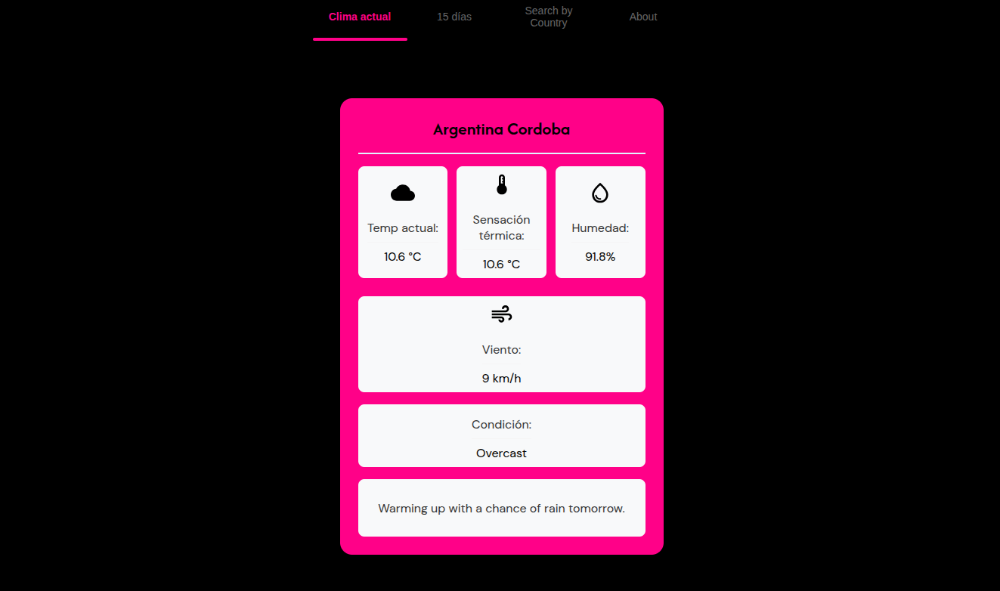
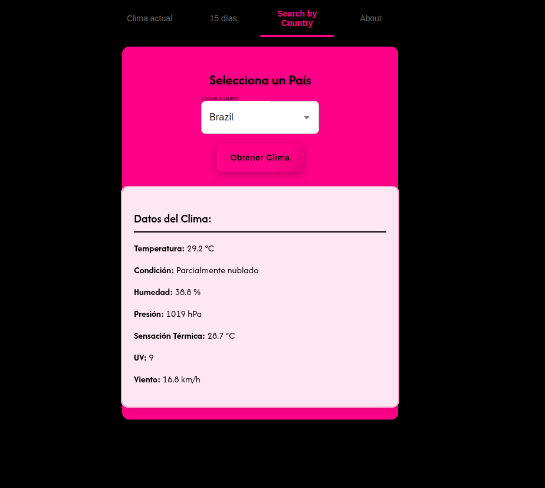
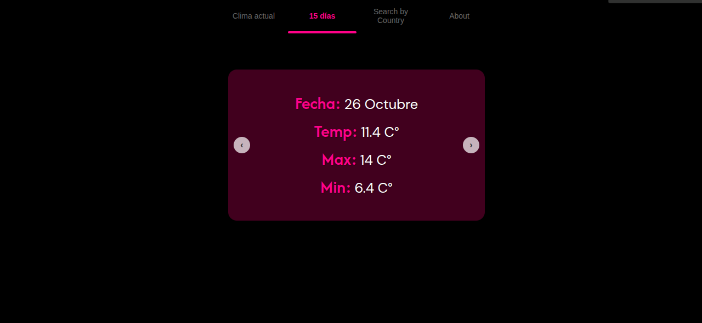

# 🌤️ Weather App
https://roadmap.sh/projects/weather-app
Una aplicación web para consultar información climática de cualquier país del mundo.

## 🎬 Demo en funcionamiento


## 📸 Screenshots

### Clima Actual


### Selector de Países


### Carrusel de Pronóstico


## ✨ Características
- 🌍 Selector de países con banderas
- 🌡️ Datos climáticos en tiempo real
- 📱 Interfaz responsive y moderna
- 🎨 Diseño atractivo con Material-UI
- 📊 Visualización detallada del clima
- 🔄 Carrusel de pronóstico extendido

## 🛠️ Tecnologías utilizadas
- **Frontend:** React 18, Material-UI
- **Build Tool:** Vite
- **Weather API:** Visual Crossing Weather API
- **Estilos:** CSS3 con gradientes modernos

## 🚀 Instalación y uso

```bash
# Clonar el repositorio
git clone https://github.com/juanfvega/my_weather.git

# Entrar al directorio
cd my_weather

# Instalar dependencias
npm install

# Ejecutar en modo desarrollo
npm run dev
```

## 🌐 API Key
Para usar la aplicación necesitas obtener una API key gratuita de [Visual Crossing Weather](https://www.visualcrossing.com/weather-api)
